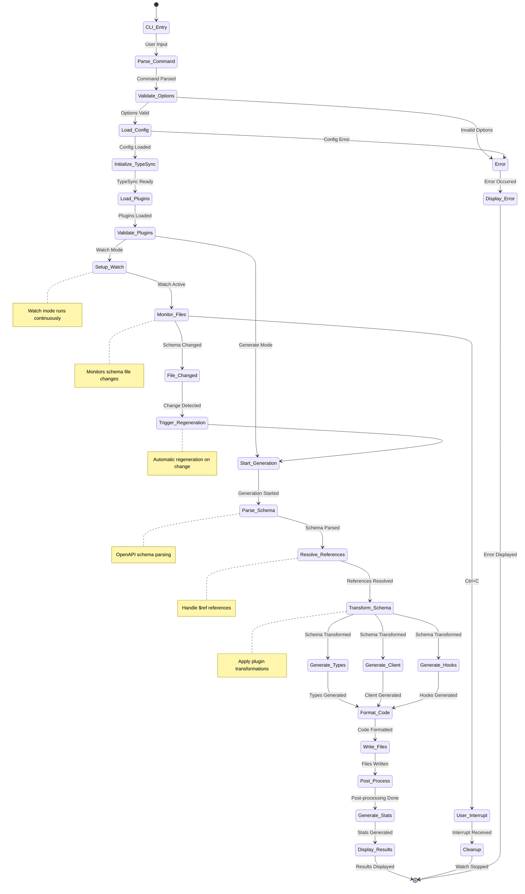

# Type-Sync CLI Command Flow

```mermaid
stateDiagram-v2
    [*] --> CLI_Entry
    CLI_Entry --> Parse_Command: User Input
    Parse_Command --> Validate_Options: Command Parsed

    Validate_Options --> Load_Config: Options Valid
    Validate_Options --> Error: Invalid Options

    Load_Config --> Initialize_TypeSync: Config Loaded
    Load_Config --> Error: Config Error

    Initialize_TypeSync --> Load_Plugins: TypeSync Ready
    Load_Plugins --> Validate_Plugins: Plugins Loaded
    Validate_Plugins --> Setup_Watch: Watch Mode
    Validate_Plugins --> Start_Generation: Generate Mode

    Setup_Watch --> Monitor_Files: Watch Active
    Monitor_Files --> File_Changed: Schema Changed
    File_Changed --> Trigger_Regeneration: Change Detected
    Trigger_Regeneration --> Start_Generation

    Start_Generation --> Parse_Schema: Generation Started
    Parse_Schema --> Resolve_References: Schema Parsed
    Resolve_References --> Transform_Schema: References Resolved

    Transform_Schema --> Generate_Types: Schema Transformed
    Transform_Schema --> Generate_Client: Schema Transformed
    Transform_Schema --> Generate_Hooks: Schema Transformed

    Generate_Types --> Format_Code: Types Generated
    Generate_Client --> Format_Code: Client Generated
    Generate_Hooks --> Format_Code: Hooks Generated

    Format_Code --> Write_Files: Code Formatted
    Write_Files --> Post_Process: Files Written
    Post_Process --> Generate_Stats: Post-processing Done

    Generate_Stats --> Display_Results: Stats Generated
    Display_Results --> [*]: Results Displayed

    Monitor_Files --> User_Interrupt: Ctrl+C
    User_Interrupt --> Cleanup: Interrupt Received
    Cleanup --> [*]: Watch Stopped

    Error --> Display_Error: Error Occurred
    Display_Error --> [*]: Error Displayed

    note right of Setup_Watch : Watch mode runs continuously
    note right of Monitor_Files : Monitors schema file changes
    note right of Trigger_Regeneration : Automatic regeneration on change
    note right of Parse_Schema : OpenAPI schema parsing
    note right of Resolve_References : Handle $ref references
    note right of Transform_Schema : Apply plugin transformations
```
