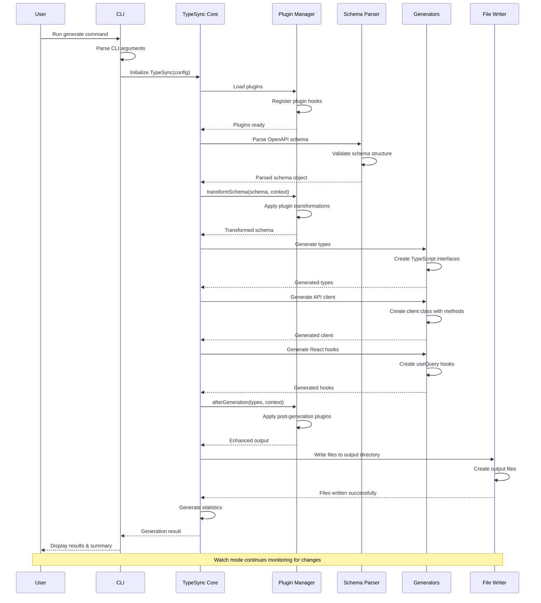

# Type-Sync Component Interaction Sequence

```mermaid
sequenceDiagram
    participant U as User
    participant C as CLI
    participant T as TypeSync Core
    participant P as Plugin Manager
    participant S as Schema Parser
    participant G as Generators
    participant F as File Writer

    U->>C: Run generate command
    C->>C: Parse CLI arguments
    C->>T: Initialize TypeSync(config)

    T->>P: Load plugins
    P->>P: Register plugin hooks
    P-->>T: Plugins ready

    T->>S: Parse OpenAPI schema
    S->>S: Validate schema structure
    S-->>T: Parsed schema object

    T->>P: transformSchema(schema, context)
    P->>P: Apply plugin transformations
    P-->>T: Transformed schema

    T->>G: Generate types
    G->>G: Create TypeScript interfaces
    G-->>T: Generated types

    T->>G: Generate API client
    G->>G: Create client class with methods
    G-->>T: Generated client

    T->>G: Generate React hooks
    G->>G: Create useQuery hooks
    G-->>T: Generated hooks

    T->>P: afterGeneration(types, context)
    P->>P: Apply post-generation plugins
    P-->>T: Enhanced output

    T->>F: Write files to output directory
    F->>F: Create output files
    F-->>T: Files written successfully

    T->>T: Generate statistics
    T-->>C: Generation result
    C-->>U: Display results & summary

    Note over U,F: Watch mode continues monitoring for changes
```
