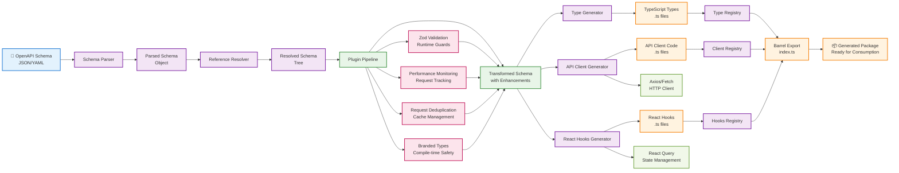

# Type-Sync Data Flow

```mermaid
flowchart LR
    A[📄 OpenAPI Schema<br/>JSON/YAML] --> B[Schema Parser]
    B --> C[Parsed Schema<br/>Object]

    C --> D[Reference Resolver]
    D --> E[Resolved Schema<br/>Tree]

    E --> F[Plugin Pipeline]
    F --> G[Transformed Schema<br/>with Enhancements]

    G --> H[Type Generator]
    G --> I[API Client Generator]
    G --> J[React Hooks Generator]

    H --> K[TypeScript Types<br/>.ts files]
    I --> L[API Client Code<br/>.ts files]
    J --> M[React Hooks<br/>.ts files]

    K --> N[Type Registry]
    L --> O[Client Registry]
    M --> P[Hooks Registry]

    N --> Q[Barrel Export<br/>index.ts]
    O --> Q
    P --> Q

    Q --> R[📦 Generated Package<br/>Ready for Consumption]

    %% Plugin Enhancements
    F --> S[Zod Validation<br/>Runtime Guards]
    F --> T[Performance Monitoring<br/>Request Tracking]
    F --> U[Request Deduplication<br/>Cache Management]
    F --> V[Branded Types<br/>Compile-time Safety]

    S --> G
    T --> G
    U --> G
    V --> G

    %% External Dependencies
    I --> W[Axios/Fetch<br/>HTTP Client]
    J --> X[React Query<br/>State Management]

    classDef input fill:#e3f2fd,stroke:#1976d2,stroke-width:2px
    classDef process fill:#f3e5f5,stroke:#7b1fa2,stroke-width:2px
    classDef transform fill:#e8f5e8,stroke:#388e3c,stroke-width:2px
    classDef output fill:#fff3e0,stroke:#f57c00,stroke-width:2px
    classDef plugins fill:#fce4ec,stroke:#c2185b,stroke-width:2px
    classDef external fill:#f1f8e9,stroke:#689f38,stroke-width:2px

    class A input
    class B,C,D,E process
    class F,G transform
    class H,I,J process
    class K,L,M output
    class N,O,P process
    class Q,R output
    class S,T,U,V plugins
    class W,X external
```
