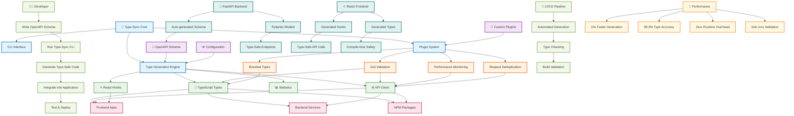

# Type-Sync Ecosystem Overview

```mermaid
graph TB
    %% Core Components
    A[🎯 Type-Sync Core] --> B[CLI Interface]
    A --> C[Type Generation Engine]
    A --> D[Plugin System]

    %% Input Sources
    E[📄 OpenAPI Schema] --> C
    F[⚙️ Configuration] --> C
    G[🔌 Custom Plugins] --> D

    %% Generation Outputs
    C --> H[📝 TypeScript Types]
    C --> I[🌐 API Client]
    C --> J[⚛️ React Hooks]
    C --> K[📊 Statistics]

    %% Plugin Enhancements
    D --> L[Zod Validation]
    D --> M[Performance Monitoring]
    D --> N[Request Deduplication]
    D --> O[Branded Types]

    L --> H
    L --> I
    M --> I
    N --> I
    O --> H

    %% Usage Contexts
    H --> P[Frontend Apps]
    I --> P
    J --> P

    H --> Q[Backend Services]
    I --> Q

    H --> R[NPM Packages]
    I --> R

    %% Development Workflow
    S[👨‍💻 Developer] --> T[Write OpenAPI Schema]
    T --> U[Run Type-Sync CLI]
    U --> V[Generate Type-Safe Code]
    V --> W[Integrate into Application]
    W --> X[Test & Deploy]

    %% FastAPI Integration
    Y[🐍 FastAPI Backend] --> Z[Auto-generated Schema]
    Z --> E
    Y --> AA[Pydantic Models]
    AA --> BB[Type-Safe Endpoints]

    %% React Integration
    CC[⚛️ React Frontend] --> DD[Generated Hooks]
    DD --> EE[Type-Safe API Calls]
    CC --> FF[Generated Types]
    FF --> GG[Compile-time Safety]

    %% CI/CD Integration
    HH[🔄 CI/CD Pipeline] --> II[Automated Generation]
    II --> JJ[Type Checking]
    JJ --> KK[Build Validation]

    %% Performance Benefits
    LL[🚀 Performance] --> MM[10x Faster Generation]
    LL --> NN[99.9% Type Accuracy]
    LL --> OO[Zero Runtime Overhead]
    LL --> PP[Sub-1ms Validation]

    classDef core fill:#e1f5fe,stroke:#01579b,stroke-width:2px
    classDef input fill:#f3e5f5,stroke:#7b1fa2,stroke-width:2px
    classDef output fill:#e8f5e8,stroke:#388e3c,stroke-width:2px
    classDef plugins fill:#fff3e0,stroke:#e65100,stroke-width:2px
    classDef usage fill:#fce4ec,stroke:#c2185b,stroke-width:2px
    classDef workflow fill:#f1f8e9,stroke:#689f38,stroke-width:2px
    classDef integration fill:#e0f2f1,stroke:#00695c,stroke-width:2px
    classDef performance fill:#fff8e1,stroke:#f57f17,stroke-width:2px

    class A,B,C,D core
    class E,F,G input
    class H,I,J,K output
    class L,M,N,O plugins
    class P,Q,R usage
    class S,T,U,V,W,X workflow
    class Y,Z,AA,BB,CC,DD,EE,FF,GG integration
    class HH,II,JJ,KK workflow
    class LL,MM,NN,OO,PP performance
```
