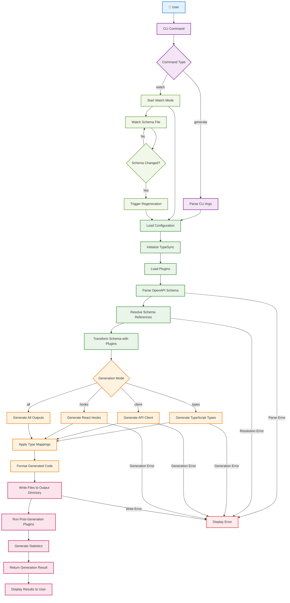

# Type-Sync Generation Flow

```mermaid
flowchart TD
    A[👤 User] --> B[CLI Command]
    B --> C{Command Type}
    C -->|generate| D[Parse CLI Args]
    C -->|watch| E[Start Watch Mode]

    D --> F[Load Configuration]
    E --> F

    F --> G[Initialize TypeSync]
    G --> H[Load Plugins]
    H --> I[Parse OpenAPI Schema]

    I --> J[Resolve Schema References]
    J --> K[Transform Schema with Plugins]

    K --> L{Generation Mode}
    L -->|types| M[Generate TypeScript Types]
    L -->|client| N[Generate API Client]
    L -->|hooks| O[Generate React Hooks]
    L -->|all| P[Generate All Outputs]

    M --> Q[Apply Type Mappings]
    N --> Q
    O --> Q
    P --> Q

    Q --> R[Format Generated Code]
    R --> S[Write Files to Output Directory]

    S --> T[Run Post-Generation Plugins]
    T --> U[Generate Statistics]
    U --> V[Return Generation Result]

    V --> W[Display Results to User]

    %% Watch Mode Loop
    E --> X[Watch Schema File]
    X --> Y{Schema Changed?}
    Y -->|Yes| Z[Trigger Regeneration]
    Y -->|No| X
    Z --> F

    %% Error Handling
    I -->|Parse Error| AA[Display Error]
    J -->|Resolution Error| AA
    M -->|Generation Error| AA
    N -->|Generation Error| AA
    O -->|Generation Error| AA
    S -->|Write Error| AA

    classDef user fill:#e3f2fd,stroke:#1976d2,stroke-width:2px
    classDef cli fill:#f3e5f5,stroke:#7b1fa2,stroke-width:2px
    classDef core fill:#e8f5e8,stroke:#388e3c,stroke-width:2px
    classDef generation fill:#fff3e0,stroke:#f57c00,stroke-width:2px
    classDef output fill:#fce4ec,stroke:#c2185b,stroke-width:2px
    classDef watch fill:#f1f8e9,stroke:#689f38,stroke-width:2px
    classDef error fill:#ffebee,stroke:#d32f2f,stroke-width:2px

    class A user
    class B,C,D cli
    class F,G,H,I,J,K core
    class L,M,N,O,P,Q,R generation
    class S,T,U,V,W output
    class E,X,Y,Z watch
    class AA error
```
