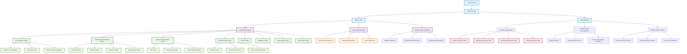

# Type-Sync Plugin Architecture

```mermaid
graph TB
    A[🔌 Plugin System] --> B[Plugin Manager]
    B --> C[Plugin Loader]
    B --> D[Plugin Registry]

    C --> E[Load Built-in Plugins]
    C --> F[Load Custom Plugins]
    C --> G[Validate Plugin Interfaces]

    D --> H[Register Plugin Hooks]
    D --> I[Manage Plugin Dependencies]
    D --> J[Handle Plugin Conflicts]

    E --> K[Zod Validation Plugin]
    E --> L[Performance Monitoring Plugin]
    E --> M[Request Deduplication Plugin]
    E --> N[Branded Types Plugin]
    E --> O[JSDoc Plugin]
    E --> P[Validation Plugin]
    E --> Q[React Query Plugin]
    E --> R[Strict Mode Plugin]

    K --> S[Runtime Type Validation]
    K --> T[Schema Caching]
    K --> U[Branded Types Integration]

    L --> V[Request Timing]
    L --> W[Bundle Analysis]
    L --> X[Memory Profiling]
    L --> Y[Regression Detection]

    M --> Z[LRU Cache]
    M --> AA[Request Coalescing]
    M --> BB[Stale-While-Revalidate]

    N --> CC[Phantom Types]
    N --> DD[Discriminated Unions]
    N --> EE[Type-Level Computations]

    F --> FF[Custom Plugin Directory]
    F --> GG[NPM Plugin Packages]
    F --> HH[Local Plugin Files]

    G --> II[Interface Validation]
    G --> JJ[Hook Method Verification]
    G --> KK[Dependency Resolution]

    H --> LL[transformSchema Hook]
    H --> MM[afterTypeGeneration Hook]
    H --> NN[afterClientGeneration Hook]
    H --> OO[beforeGeneration Hook]

    I --> PP[Plugin Ordering]
    I --> QQ[Dependency Injection]
    I --> RR[Circular Dependency Detection]

    J --> SS[Hook Conflict Resolution]
    J --> TT[Plugin Override Handling]
    J --> UU[Version Compatibility]

    classDef system fill:#e1f5fe,stroke:#01579b,stroke-width:2px
    classDef manager fill:#f3e5f5,stroke:#4a148c,stroke-width:2px
    classDef builtin fill:#e8f5e8,stroke:#1b5e20,stroke-width:2px
    classDef custom fill:#fff3e0,stroke:#e65100,stroke-width:2px
    classDef hooks fill:#fce4ec,stroke:#880e4f,stroke-width:2px
    classDef features fill:#f1f8e9,stroke:#33691e,stroke-width:2px

    class A,B,C,D system
    class E,F,G manager
    class K,L,M,N,O,P,Q,R builtin
    class FF,GG,HH custom
    class LL,MM,NN,OO hooks
    class S,T,U,V,W,X,Y,Z,AA,BB,CC,DD,EE features
```
