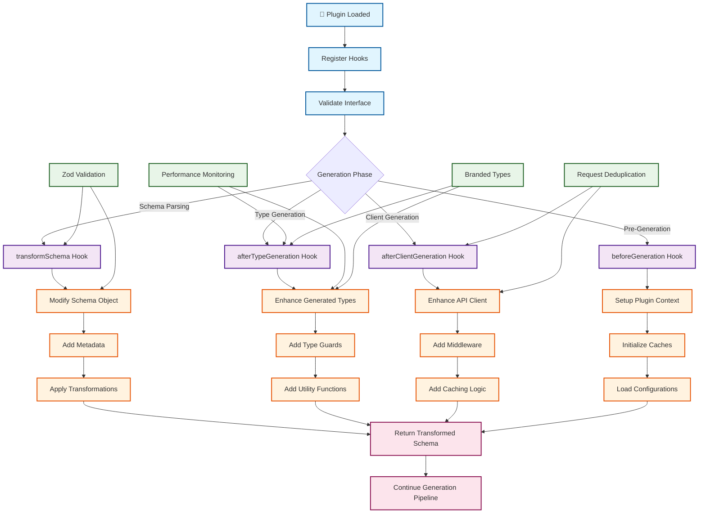

# Type-Sync Plugin Lifecycle

```mermaid
flowchart TD
    A[🔌 Plugin Loaded] --> B[Register Hooks]
    B --> C[Validate Interface]

    C --> D{Generation Phase}

    D -->|Schema Parsing| E[transformSchema Hook]
    D -->|Type Generation| F[afterTypeGeneration Hook]
    D -->|Client Generation| G[afterClientGeneration Hook]
    D -->|Pre-Generation| H[beforeGeneration Hook]

    E --> I[Modify Schema Object]
    I --> J[Add Metadata]
    J --> K[Apply Transformations]

    F --> L[Enhance Generated Types]
    L --> M[Add Type Guards]
    M --> N[Add Utility Functions]

    G --> O[Enhance API Client]
    O --> P[Add Middleware]
    P --> Q[Add Caching Logic]

    H --> R[Setup Plugin Context]
    R --> S[Initialize Caches]
    S --> T[Load Configurations]

    K --> U[Return Transformed Schema]
    N --> U
    Q --> U
    T --> U

    U --> V[Continue Generation Pipeline]

    %% Plugin Types
    W[Zod Validation] --> E
    X[Performance Monitoring] --> F
    Y[Request Deduplication] --> G
    Z[Branded Types] --> F

    W --> I
    X --> L
    Y --> O
    Z --> L

    classDef lifecycle fill:#e1f5fe,stroke:#01579b,stroke-width:2px
    classDef hooks fill:#f3e5f5,stroke:#4a148c,stroke-width:2px
    classDef plugins fill:#e8f5e8,stroke:#1b5e20,stroke-width:2px
    classDef actions fill:#fff3e0,stroke:#e65100,stroke-width:2px
    classDef flow fill:#fce4ec,stroke:#880e4f,stroke-width:2px

    class A,B,C lifecycle
    class E,F,G,H hooks
    class I,J,K,L,M,N,O,P,Q,R,S,T actions
    class U,V flow
    class W,X,Y,Z plugins
```
