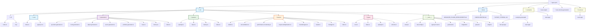

# Type-Sync Project Structure

```mermaid
graph TB
    A[📁 type-sync/] --> B[📁 src/]
    A --> C[📁 docs/]
    A --> D[📁 examples/]
    A --> E[📁 test-output/]
    A --> F[📁 test-schema-generation/]
    A --> G[📁 local-test/]

    B --> H[📁 cli/]
    B --> I[📁 core/]
    B --> J[📁 generators/]
    B --> K[📁 parsers/]
    B --> L[📁 plugins/]
    B --> M[📁 types/]
    B --> N[📁 __tests__/]

    H --> O[index.ts]
    H --> P[cli.js]

    I --> Q[index.ts]
    I --> R[typesync.ts]

    J --> S[api-client-generator.ts]
    J --> T[hook-generator.ts]
    J --> U[object-generator.ts]
    J --> V[enum-generator.ts]
    J --> W[primitive-generator.ts]
    J --> X[base.ts]
    J --> Y[factory.ts]
    J --> Z[index.ts]

    K --> AA[openapi.ts]
    K --> BB[base.ts]
    K --> CC[factory.ts]
    K --> DD[index.ts]

    L --> EE[builtin.ts]
    L --> FF[zod-validation.ts]
    L --> GG[performance-monitoring.ts]
    L --> HH[request-deduplication.ts]
    L --> II[branded-types.ts]
    L --> JJ[loader.ts]
    L --> KK[manager.ts]
    L --> LL[index.ts]

    M --> MM[core.ts]
    M --> NN[index.ts]
    M --> OO[openapi.ts]
    M --> PP[schema.ts]

    N --> QQ[setup.ts]
    N --> RR[test-config.ts]
    N --> SS[typesync.test.ts]
    N --> TT[generators/]
    N --> UU[integration/]
    N --> VV[parsers/]
    N --> WW[plugins/]

    C --> XX[ADVANCED_PLUGIN_DEVELOPMENT.md]
    C --> YY[CONFIGURATION.md]
    C --> ZZ[FASTAPI_TUTORIAL.md]

    D --> AAA[example-generated/]
    D --> BBB[react-app/]

    AAA --> CCC[fast-api-app/]
    AAA --> DDD[react-app/]

    G --> EEE[react-app/]

    classDef core fill:#e1f5fe,stroke:#01579b,stroke-width:2px
    classDef generators fill:#f3e5f5,stroke:#4a148c,stroke-width:2px
    classDef parsers fill:#e8f5e8,stroke:#1b5e20,stroke-width:2px
    classDef plugins fill:#fff3e0,stroke:#e65100,stroke-width:2px
    classDef types fill:#fce4ec,stroke:#880e4f,stroke-width:2px
    classDef tests fill:#f1f8e9,stroke:#33691e,stroke-width:2px
    classDef docs fill:#e3f2fd,stroke:#0d47a1,stroke-width:2px
    classDef examples fill:#f9fbe7,stroke:#827717,stroke-width:2px

    class B,I core
    class J generators
    class K parsers
    class L plugins
    class M types
    class N tests
    class C docs
    class D,G examples
```
